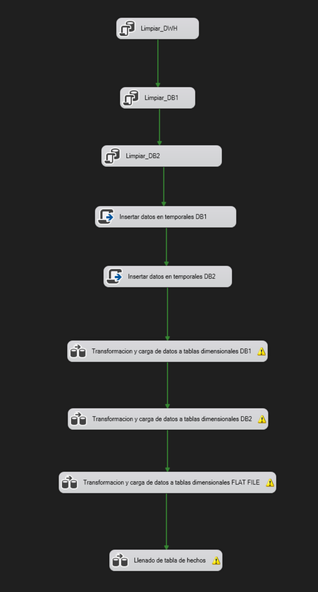
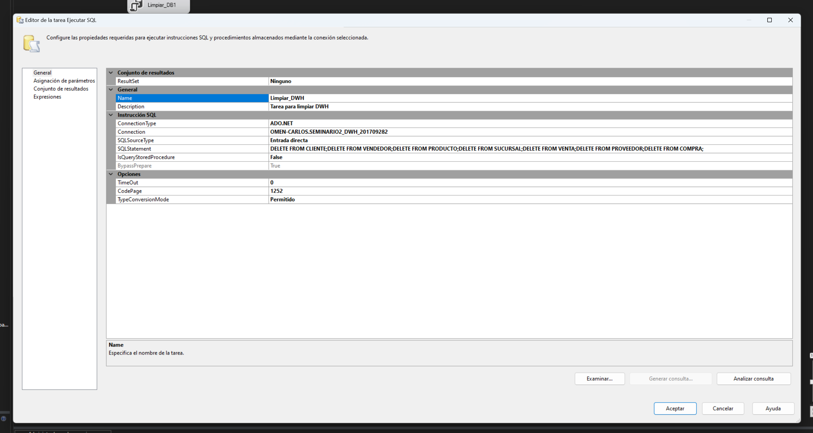
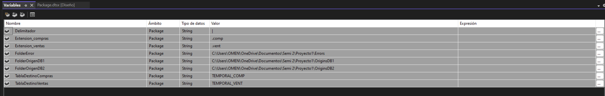
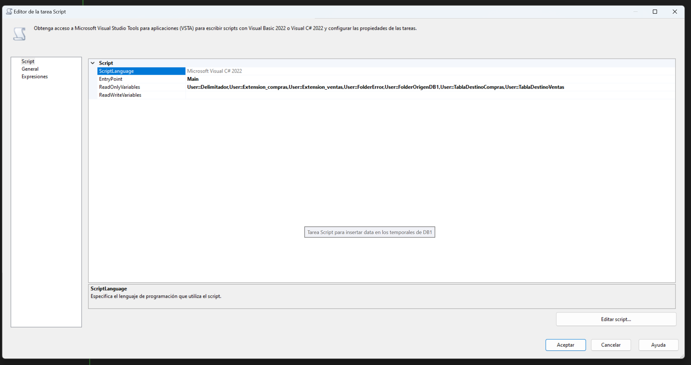
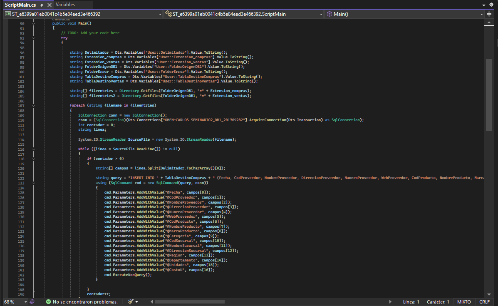
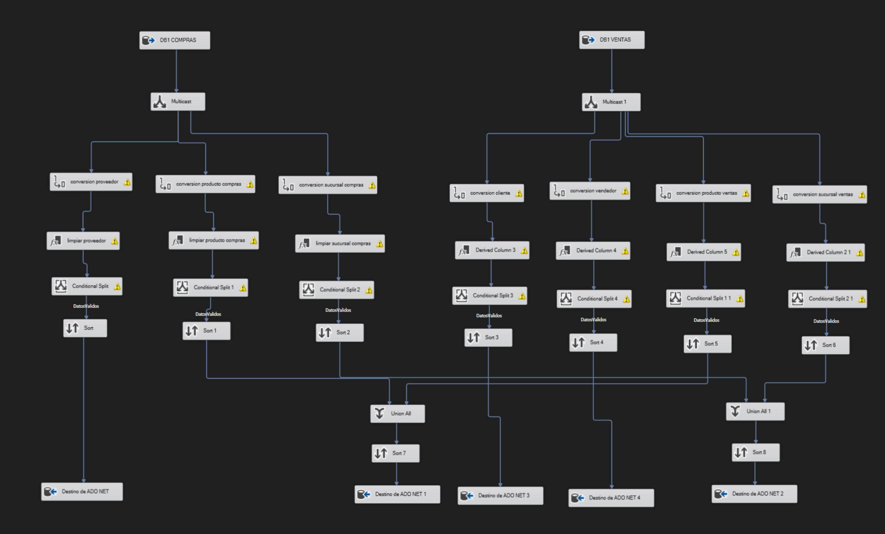
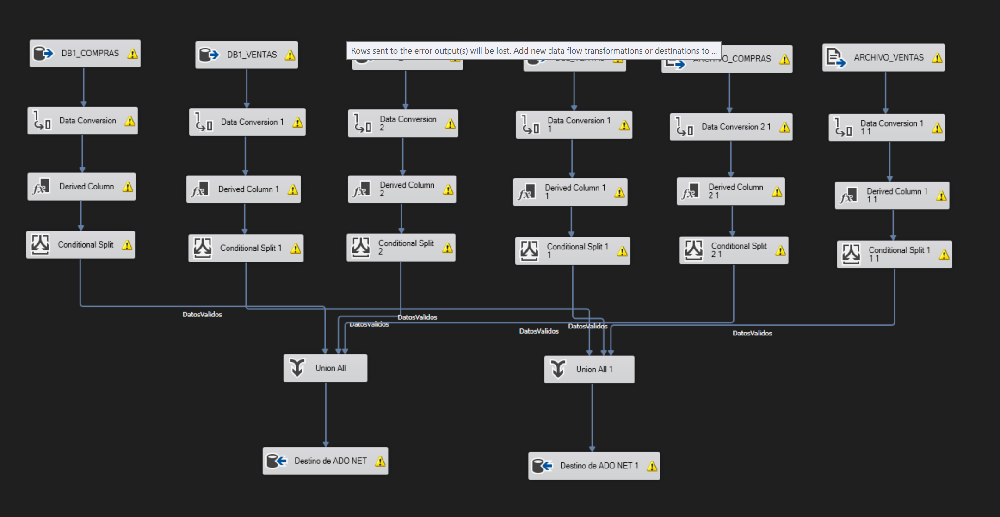
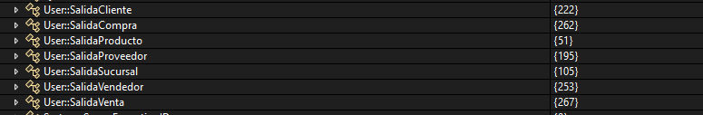

# DOCUMENTACION

# Proyecto 1 Laboratorio de Seminario de Sistemas 2

## Solución al proyecto SG-Food

Para la solución se implementaron 3 bases de datos de SQL Server 

* SEMINARIO2_DB1_201709282
* SEMINARIO2_DB2_201709282

Como bases de alimentacion del DataWarehouse

* SEMINARIO2_ DWH_201709282

Como base de datos principal para el DataWarehouse

## Flujo de control

	

Iniciamos el flujo con Tareas Ejecutar SQL, que nos sirven para la limpieza de las tablas de nuestras bases de datos 
de alimentacion y nuestra base de datos del DataWarehouse.

Luego de la limpieza, ejecutamos una Tarea script para insertar los datos en las tablas temporales de compras y ventas 
de cada base de datos.

### Definicion de variables

### Asignacion de variables

### Desarrollo del script

Luego de la inserción de datos en las tablas temporales vienen las Tareas de flujo de datos que nos permiten la limpieza
y transformacion de la data por medio de un flujo de datos interno que maneja diferentes componentes para llegar al 
resultado final esperado. Se realizó un flujo para extraer la data de la base de datos  SEMINARIO2_DB1_201709282, 
otro flujo para SEMINARIO2_DB2_201709282 que son bases de datos de alimentacion del DataWarehouse, al igual que el archivo plano, en estos primeros 
flujos alimentamos las tablas dimensionales del DataWarehouse.

Por último tenemos un flujo que extrae la información de todas las fuentes (bases de datos y archivo plano) para insertarlas en las tablas de hechos
del DataWarehouse.

Se utilizaron componentes de conexion de base de datos de ADO.NET para una mayor facilidad en el manejo de conexiones y querys.

### Resultados

## Justificacion del modelo utilizado

Se utilizó un modelo constelacion, porque es un modelo que tiene 2 tablas de hechos que tienen relaciones con diferentes dimensiones e incluso hay dimensiones
que se relacionan con ambas tablas de hecho.

### Aquí hay algunas razones clave por las que se implementa un modelo de constelación en un Data Warehouse:

#### Flexibilidad en el modelado de datos: 

El modelo constelación permite modelar relaciones complejas entre los datos de una manera más flexible que el modelo estrella tradicional. Al permitir múltiples tablas de hechos y dimensiones compartidas, los analistas pueden modelar de manera más precisa y efectiva las relaciones entre diferentes aspectos de los datos.

#### Manejo de múltiples procesos de negocio: 

En entornos donde hay múltiples procesos de negocio o áreas funcionales con diferentes conjuntos de métricas y dimensiones, el modelo constelación proporciona la capacidad de manejar estas complejidades de manera más efectiva. Cada tabla de hechos puede estar asociada con un proceso de negocio específico, lo que facilita el análisis y la generación de informes para cada área funcional.

#### Escalabilidad: 

El modelo constelación es altamente escalable y puede adaptarse fácilmente a medida que cambian las necesidades del negocio o se agregan nuevas fuentes de datos. La capacidad de agregar nuevas tablas de hechos o dimensiones sin afectar la estructura existente del modelo permite una mayor flexibilidad y adaptabilidad a medida que el Data Warehouse crece y evoluciona con el tiempo.

#### Mejora del rendimiento:

Al distribuir la carga entre múltiples tablas de hechos en lugar de depender de una única tabla central de hechos, el modelo constelación puede mejorar el rendimiento del sistema al reducir la cantidad de datos que deben ser procesados en cada consulta. Esto puede ser especialmente beneficioso en entornos donde se realizan consultas complejas o de gran volumen.

